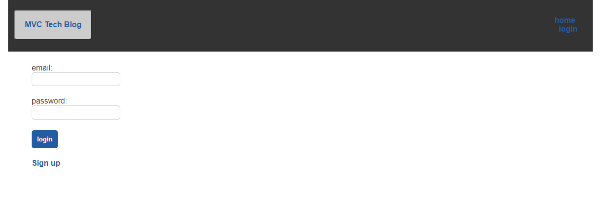

# MVC Tech Blog

## Table of Contents
1. [Description](#description)
2. [Installation](#installation)
3. [Usage](#usage)
4. [License](#license)
5. [Contributing](#contributing)
6. [Questions](#questions)

## Description
A CMS-style blog site similar to a Wordpress site, where developers can publish their blog posts and comment on other developers’ posts as well. 
Built completely from scratch and deployed it to Heroku. Follows the MVC paradigm in its architectural structure, using Handlebars.js as the templating language, Sequelize as the ORM, and the express-session npm package for authentication.

## Installation
Install Node, type "npm install" in the terminal of the root directory.
Afterwards, create a ".env" file and add your DB_NAME as "mvc_tech_blog_db", DB_USER, and DB_PW.

## Usage
Log into mysql with "mysql -u <mysql username> -p"  in your terminal in the root directory. Run the command "source db/schema.sql", and then "npm run seed".

To start the server type "npm start" into your terminal and navigate to http://localhost:3001/ in your browser.  
[Heroku Deployment](https://protected-journey-29022.herokuapp.com/)

## License
MIT

## Contributing
This is open-source so feel free to edit and add as you see fit.

## Questions
For questions or concerns regarding this project or future collaborations please contact me at anukazan@gmail.com.
Github - github.com/AnukaZan
